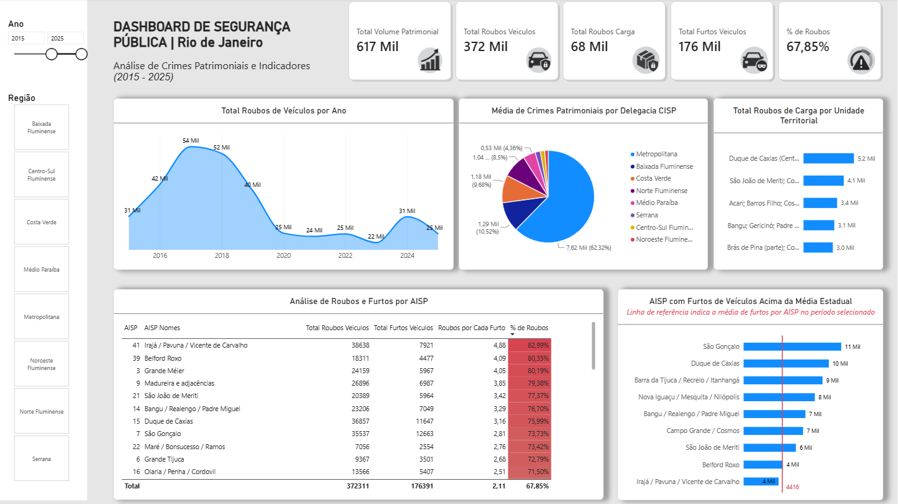

# 🛡️ Dashboard de Segurança Pública | Rio de Janeiro
> **Tratamento de Dados, Modelagem e Análise de Crimes Patrimoniais (2015 – 2025)**

👉 [**🔗 ACESSAR DASHBOARD INTERATIVO NO POWER BI WEB**](https://app.powerbi.com/view?r=eyJrIjoiY2ExNzMxZjYtMzRkMy00YWE0LTlmNmQtNTkzNjM2OTgxMmRjIiwidCI6IjY1OWNlMmI4LTA3MTQtNDE5OC04YzM4LWRjOWI2MGFhYmI1NyJ9)

---

## 📌 Motivação do Projeto
Desenvolvi este projeto por curiosidade analítica em relação à dinâmica da criminalidade patrimonial do estado. O objetivo principal foi explorar dados brutos oficiais e construir uma estrutura de dados consistente para extrair diagnósticos operacionais.

**Escopo de Estudo:**
* 🚗 Roubo de Veículos
* 📦 Roubo de Carga
* 🔑 Furto de Veículos

> [!NOTE]
> **Foco do Projeto:** Transformar grandes volumes de ocorrências históricas brutas em indicadores operacionais claros para apoio à tomada de decisão e análise espacial.

---

## 🔗 Link de Acesso
* **Relatório Web:** [Visualizar Painel Interativo no Power BI Online](https://app.powerbi.com/view?r=eyJrIjoiY2ExNzMxZjYtMzRkMy00YWE0LTlmNmQtNTkzNjM2OTgxMmRjIiwidCI6IjY1OWNlMmI4LTA3MTQtNDE5OC04YzM4LWRjOWI2MGFhYmI1NyJ9)

---

## 🗂️ Fontes de Dados
Dados abertos obtidos através da plataforma **Base dos Dados** (`basedosdados.org`), com base nos registos oficiais do Instituto de Segurança Pública do Rio de Janeiro (ISP-RJ).

> **Sobre os Dados:** O Instituto de Segurança Pública do Rio de Janeiro (ISP) fornece bases de dados de registros criminais e de atividade policial. As estatísticas divulgadas são construídas a partir dos Registros de Ocorrência (RO) lavrados nas delegacias da Secretaria de Estado de Polícia Civil do Rio de Janeiro (SEPOL), além de informações complementares de órgãos específicos da Secretaria de Estado de Polícia Militar do Rio de Janeiro (SEPM). Antes de serem consolidados no ISP, os RO são submetidos ao controle de qualidade realizado pela Corregedoria Geral de Polícia (CGPOL) da Secretaria de Estado de Polícia Civil. As estatísticas produzidas baseiam-se na data em que foi confeccionado o Registro de Ocorrência.

**Arquivos utilizados (disponíveis na pasta [`data`](./data)):**
1. [`br_rj_isp_estatisticas_seguranca_evolucao_mensal_cisp.csv`](./data/br_rj_isp_estatisticas_seguranca_evolucao_mensal_cisp.csv): Histórico mensal de ocorrências de segurança pública por CISP.
2. [`br_rj_isp_estatisticas_seguranca_relacao_cisp_aisp_risp.csv`](./data/br_rj_isp_estatisticas_seguranca_relacao_cisp_aisp_risp.csv): Mapeamento e hierarquia geográfica (CISP, AISP e RISP).

---

## 🛠️ Tecnologias e Ferramentas

* **SQL Server:** Importação, higienização de texto, criação de tabelas dimensionais e validação de lógicas analíticas com CTEs, Funções de Janela e Agregações.
* **Power BI:** Modelagem dimensional (Star Schema), fórmulas em DAX, personalização de visuais e construção do relatório interativo.

---

## ⚙️ Passo a Passo do Desenvolvimento

| Etapa | Foco Técnico | Descrição & Principais Ações |
| :--- | :--- | :--- |
| **1. Saneamento & Estruturação** *(SQL Server)* | `Tratamento`   `Modelagem` | • **Higienização de Texto:** Correção de caracteres e acentuação no campo `regiao`. • **Dimensão AISP (`Dim_AISP`):** Mapeamento manual associando o código do Batalhão (BPM) ao seu nome e área de atuação. |
| **2. Validação & Regras de Negócio** *(SQL Server)* | `Window Functions`   `CTEs & Rankings` | • **Inteligência Temporal:** Variação percentual ano a ano (YoY) via `LAG()`. • **Agrupamento Geográfico:** Mapeamento de CISPs ativas via `STRING_AGG()`. • **Rankings e Outliers:** Identificação de áreas críticas com `ROW_NUMBER() OVER(PARTITION BY...)`. • **Índices de Gravidade:** Proporção entre roubos e furtos por região. |
| **3. Visualização & UX** *(Power BI & DAX)* | `Star Schema`   `DAX Dinâmico` | • **Modelagem Star Schema:** Organização entre tabela fato, dimensões e repositório centralizado (`_Medidas`). • **Medidas em DAX:** Criação de métricas de `Total Volume Patrimonial`, `Gravidade %`, `Roubos por Cada Furto`, `Média Furtos por CISP` e outros. • **Análise Decenal (2015–2025):** Expansão do escopo para 10 anos de dados com interatividade fluida por filtros dinâmicos. |

---

## 💡 Principais Insights Encontrados (2015 – 2025)

* **Predomínio do Uso de Violência (High Risk):** Do volume total patrimonial analisado (**617 Mil** casos), **67,85%** correspondem a **Roubos de Veículos** (**372 Mil**), evidenciando que a maioria expressiva das abordagens automotivas no estado ocorre de forma violenta, enquanto os furtos respondem por **176 Mil** ocorrências.
* **Trajetória e Tendência Histórica:** O volume de roubos de veículos atingiu seu pico histórico em 2017 (**54 Mil** casos/ano) e apresentou uma queda acentuada até 2023, onde atingiu a mínima da série temporal (**22 Mil**). Em 2024 registrou-se um repique pontual (**31 Mil**), voltando a cair em 2025 (**25 Mil**).
* **Gargalos do Roubo de Carga:** Das **68 Mil** ocorrências de roubo de carga no período, a mancha criminal está fortemente concentrada na Baixada Fluminense e Subúrbio, tendo como principais eixos críticos **Duque de Caxias (Centro)** com **5,2 Mil** casos e **São João de Meriti** com **4,1 Mil**.
* **Hotspots de Maior Gravidade Relativa (AISP):** O **41º BPM (Irajá / Pavuna / Vicente de Carvalho)** e o **39º BPM (Belford Roxo)** registram os maiores índices de gravidade do estado, com **82,99%** e **80,35%** de proporcionalidade de roubos sobre furtos, registrando mais de **4 roubos para cada 1 furto**.
* **Anomalia de Furtos por Batalhão:** Enquanto Irajá apresenta altíssimo roubo e baixos furtos, o batalhão de **São Gonçalo** lidera isolado o volume de **Furtos de Veículos (11 Mil)**, ficando muito acima da média estatal por AISP (**4.416** ocorrências).

---

## 👤 Autor

**Thompson M Lima**
